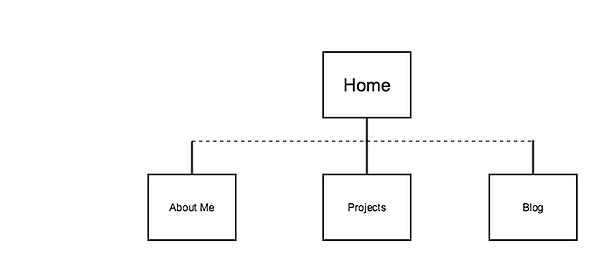

Reflection

Inline Style:

1. What are the 6 Phases of Web Design?
The 6 phases of Web Design are:
  1) Information Gathering: knowing the purpose of the web site, goal, target audience and the content being put on;
  2) Planning: plan the web site with the information gather;
  3) Design: the phase to put together the information and design user experience;
  4) Development: implement the design while keep improving the design throughout the course;
  5) Test and Delivery: fully test the website and host the site for discovery
  6) Maintenance: routine maintenance such as backups, upgrade peripheral, add in plugins, etc.

2. What is your site's primary goal or purpose? What kind of content will your site feature?
I would like to use the site for informational purpose telling the experience I have throughout the whole process of studying in DBC in NYC. I believe it would be a very exciting advanture and sharing this advanture in multiple ways is the main purpose of the site: housing, transportation, food, culture, and actual DBC works.

3. What is your target audience's interests and how do you see your site addressing them?
The target audience will be the one interested in DBC, or lives in NYC, or actually someone interested in me. Life is full of surprises.

4. What is the primary "action" the user should take when coming to your site? Do you want them to search for information, contact you, or see your portfolio? It's ok to have several actions at once, or different actions for different kinds of visitors.
Since the site is mostly informational, the primary action for the user is to browse and search for different information. Eventually after going through the design steps, a very clear and user-friendly interface could help browsing the content of this site.

5. What are the main things someone should know about design and user experience?
The main thing to know about is how closely design and user experience (UX) related to each other. In fact UX is the driving force in nowaday's web design, since it is getting more and more user centric. All the websites that stand out are the ones that are pleasant to use, efficient, and meet the users' needs. Clearly these are the main attributes for the new age websites because that's exactly what users are looking for. The value of the website is mostly reflected by the amount of users.

6. What is user experience design and why is it valuable?
User experience design focus on meeting the users' expectation. As stated above, users are looking for websites that has their information well structured, easy to use and browse, and pleasant to used. If a website has no user, all the information on the site is meaningless.

7. Which parts of the challenge did you find tedious?
I don't find any of the challenges tedious. Problem is that I have not completely decided what to put on my website. It is very useful to learn all that designing theory before the actual practice.

