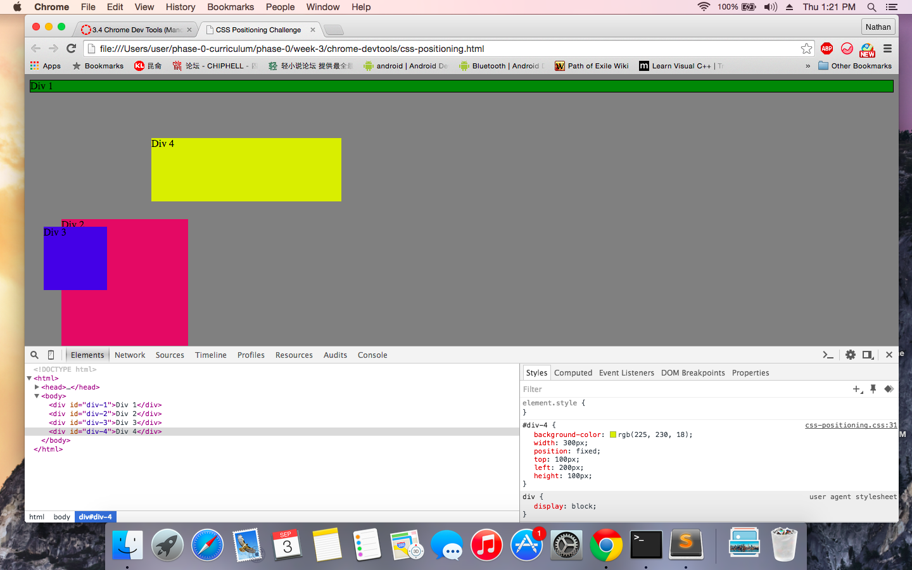
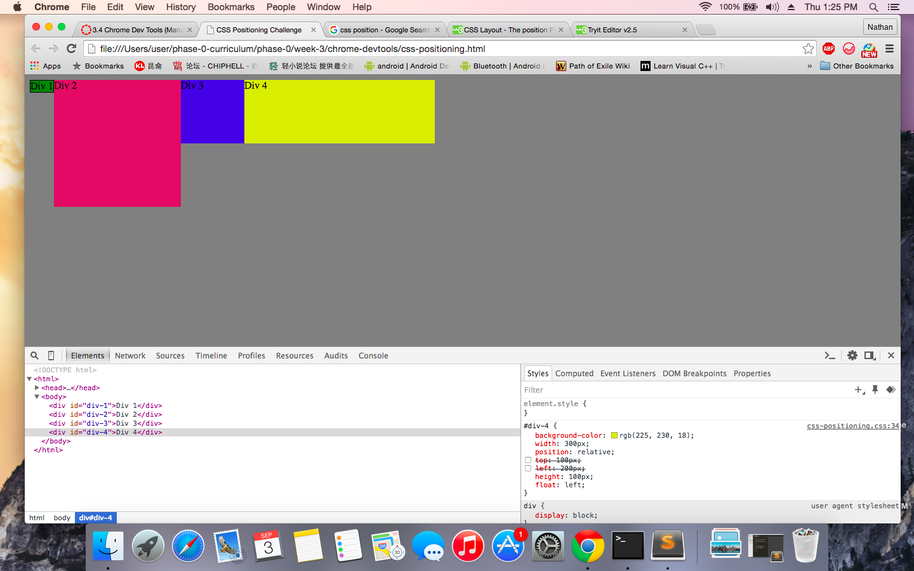
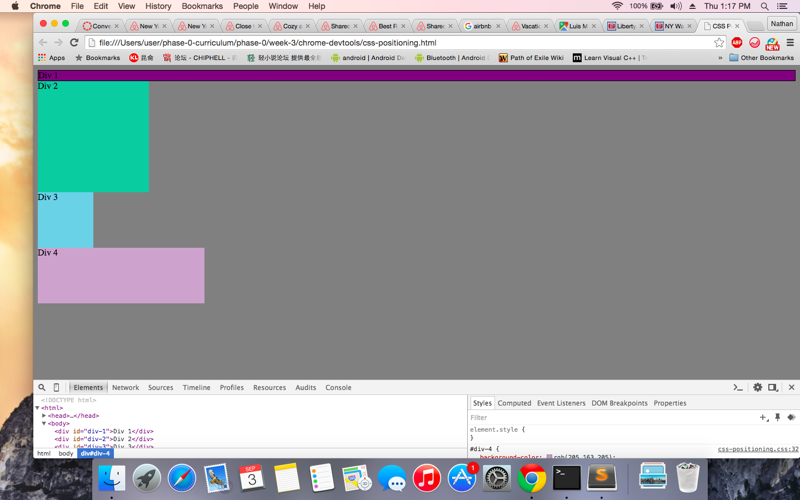
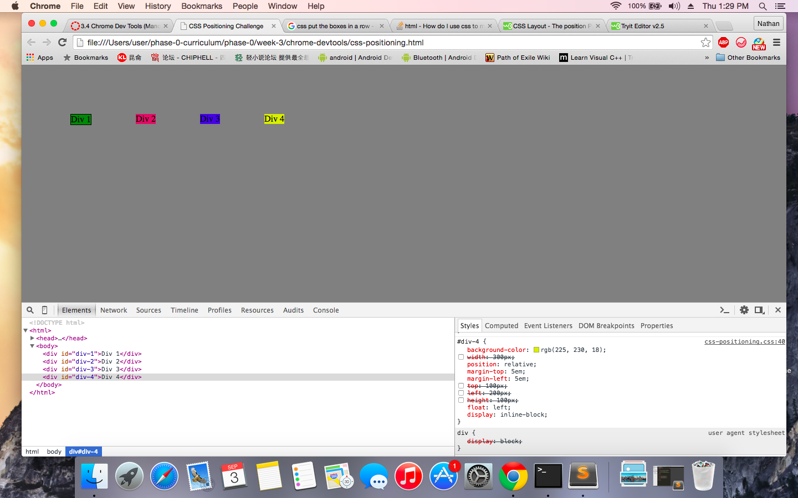
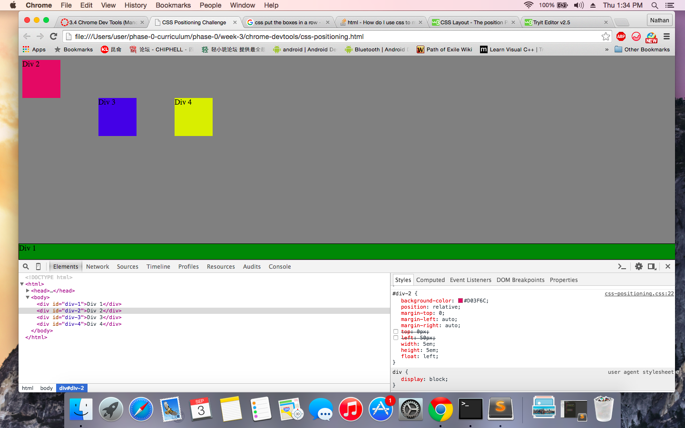
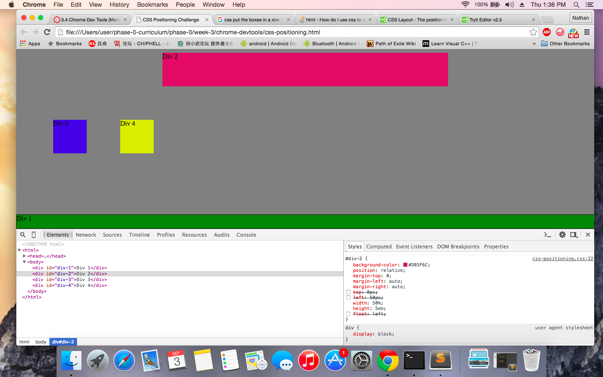
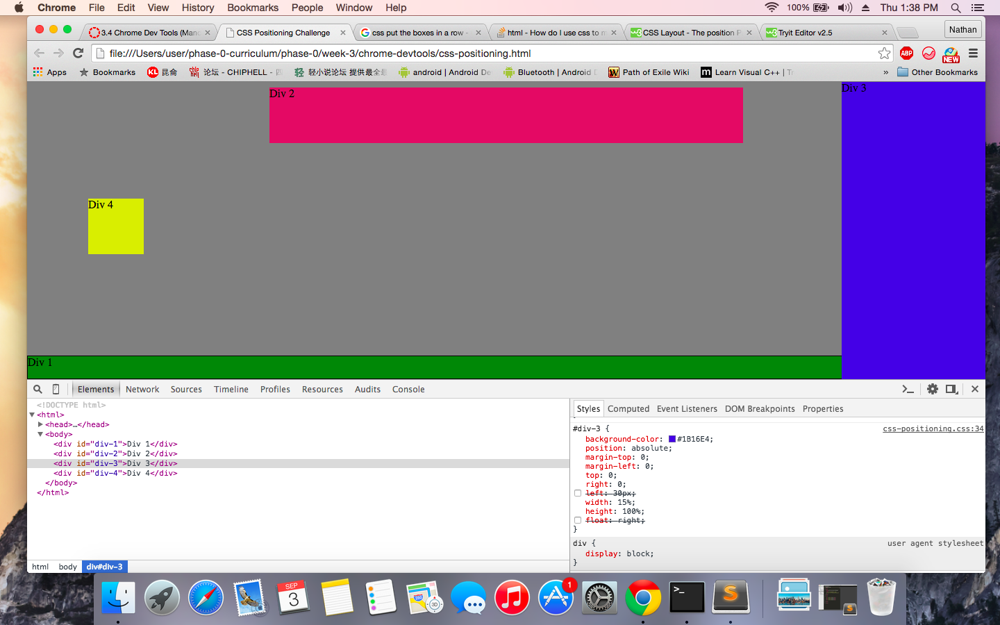
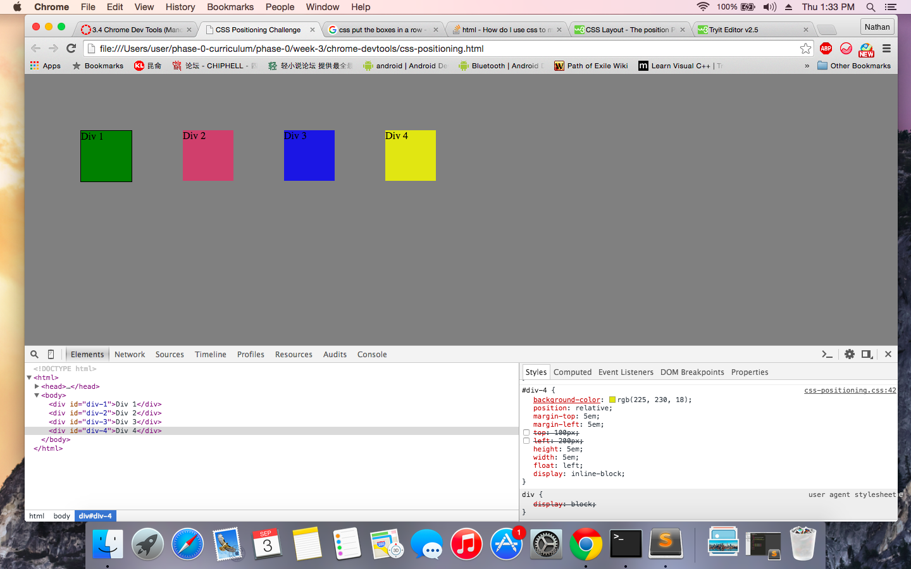

**How can you use Chrome's DevTools inspector to help you format or position elements?**
We can inspect each element's html code and the corresponding css style to change their property accordingly

**How can you resize elements on the DOM using CSS?**
We can change the size of the elements in the Chrome DevTools width and height property of the element

**What are the differences between Absolute, Fixed, Static, and Relative positioning? Which did you find easiest to use? Which was most difficult?**
Static is the default mode, meaning the normal position it would appear as the html order. Fixed is a specific position that won't change event the screen is different (scroll down or up, etc). Absolute will make the position not related to any other elements. Relative is the opposite of absolute mode, in which the element will be placed related to the other elements (parent or siblings).

**What are the differences between Margin, Border, and Padding?**
Margin is the space outside the elements, padding is the space inside the element, border is the interface between the inside and the outside of the element.

**What was your impression of this challenge overall? (love, hate, and why?)**
It is a very interesting challenge but a bit more confusing than others.
