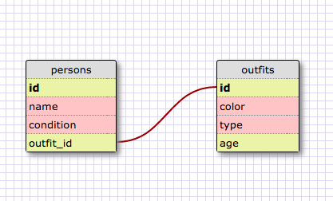

**Exercises**
1. sqlite> SELECT * FROM states;
2. sqlite> SELECT * FROM regions;
3. sqlite> SELECT state_name, population FROM states;
4. sqlite> SELECT state_name, population FROM states ORDER BY population DESC;
5. sqlite> SELECT state_name FROM states WHERE region_id = 7;
6. sqlite> SELECT state_name, population_density FROM states WHERE population_density > 50 ORDER BY population_density ASC;
7. sqlite> SELECT state_name FROM states WHERE population BETWEEN 1000000 and 1500000;
8. sqlite> SELECT state_name, region_id FROM states ORDER BY region_id ASC;
9. sqlite> SELECT region_name FROM regions WHERE region_name LIKE '%Central%';
10. sqlite> SELECT regions.region_name, states.state_name FROM regions
   ...> LEFT JOIN states WHERE regions.id = states.region_id
   ...> ORDER BY regions.id;

Screen Shot for sample linked tables:

**What are databases for?**

Databases are for storing large amount of data and group them in a meaningful way. They are the physical representation of the relational theory.

**What is a one-to-many relationship?**

It is like a inclusive relationship. For example, bike is one type of vehicle, vehicle has many different types. Here vehicle is the one, which has many children types. Bike is one of the many types.

**What is a primary key? What is a foreign key? How can you determine which is which?**

A primary key is the key value for the table. They need to be unique and not NULL. Most of the time it is used to linked with another table.

**How can you select information out of a SQL database? What are some general guidelines for that?**
Selecting information is like writing the sentence in a slightly different way. The syntax of the SQL is very plain. It is like structured in a way similar to an English sentence, spelling out the logic of the information selection.
