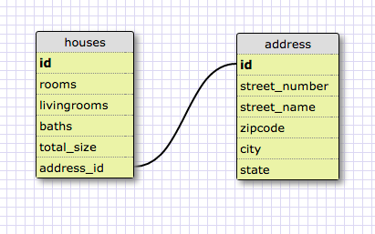
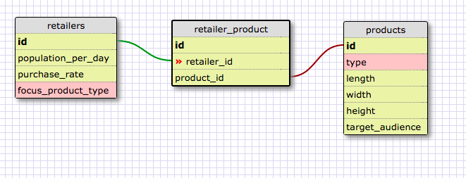
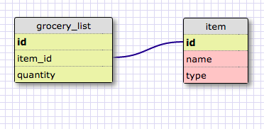

**Reflection**

**What is a one-to-one database?**

One-to-one database contains multiple tables. Each item in one of the tables correspond to a single specific item in another table, which created a one-to-one relationship.

**When would you use a one-to-one database? (Think generally, not in terms of the example you created).**

When a single entry in the table has too many attributes, we can group up attributes base on their relativity and put them into a separate table. This way we can make sure each entry in the original table will only link to one single entry in the new table.

**What is a many-to-many database?**

When the entries of a table can be joint with the entries of another table, these two tables create a many-to-many relationship. combining them will become a many-to-many database. For example one student can have many classes, and one class can have many students.

**When would you use a many-to-many database? (Think generally, not in terms of the example you created).**

See answer above.

**What is confusing about database schemas? What makes sense?**

Most of the idea make sense. Basically there are three kinds of relationship: one-to-one, one-to-many, many-to-many. There relationship can help chain up the structure to make complicated nested database. But the database itself needs to have a very clear logic.

One-to-one database:

Many-to-many database:

Grocery-item schema:

